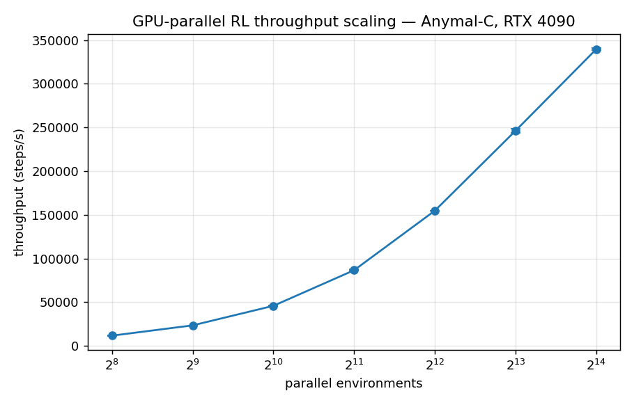
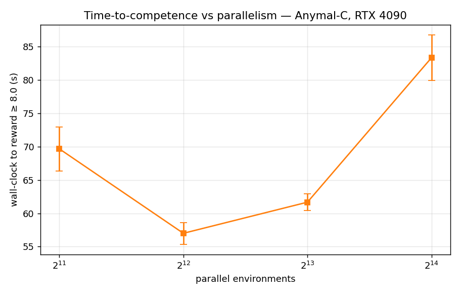
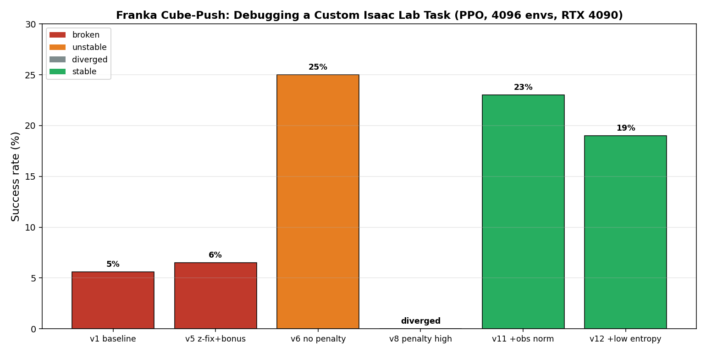

# GPU-Parallel Reinforcement Learning in NVIDIA Isaac Lab

Three reinforcement-learning components built on NVIDIA Isaac Sim 5.1 / Isaac Lab 2.3.2, trained on a single RTX 4090 (shared headless server) over ~2 days: a **throughput-scaling study**, a **quadruped locomotion** policy, and an **authored-from-scratch manipulation task** with a full reward/stability debugging analysis.

**Author:** [Hassan](https://github.com/IAmHassanMehmood) · Built with Isaac Lab `v2.3.2`, `rsl_rl` PPO, Python 3.11.
**Trained model:** [Hassan](https://huggingface.co/hhmm1122/Franka-cube-isaaclab)

---

## 1. Throughput Scaling Study (GPU-parallel RL)

Benchmarked PPO training throughput and sample-efficiency across **64× environment scaling** (256 → 16,384 parallel envs) on one RTX 4090, using the Anymal-C velocity task, 3 seeds per setting.

**Key finding:** throughput scales near-linearly up to ~2,048 envs (11.7k → 86.6k steps/s) then saturates, peaking at **339,510 steps/s at 16,384 envs**. But *time-to-competence is U-shaped* — the fastest path to a working policy is **4,096 envs**, not the highest-throughput 16,384. **Peak GPU throughput ≠ peak sample-efficiency**: beyond ~4k envs, larger batches add compute without proportional learning benefit. (Data: `results/scaling_results.csv`.)

## 2. Quadruped Locomotion (Anymal-C)

Velocity-tracking locomotion trained with `rsl_rl` PPO across 4,096 parallel envs, converging to a stable walking gait in ~4 minutes (300 iterations). Velocity-tracking reward ≈ 0.88; >95% of episodes end by timeout rather than falling.

_Video: `videos/anymal_locomotion.mp4`_

## 3. Custom Manipulation Task: Franka Cube-Push (flagship)

Authored a new **goal-conditioned push task** in Isaac Lab's manager-based framework, derived from the stock `lift` scaffold. The robot must push a cube to a sampled target position on the table. Changes from `lift`: goal command grounded to the table plane; lift reward removed and goal-tracking ungated; a custom sparse `success_bonus` term and a success termination added.

_Video: `videos/push_v11_showcase.mp4` — final policy, 32 parallel envs._

### The debugging journey (the actual content)

Getting a contact-rich manipulation policy to train is non-trivial; this task required diagnosing **six** distinct failure modes:

1. **Unreachable success (z-offset):** goal plane and cube center differed by more than the success threshold → success was geometrically impossible. Diagnosed because success *fell* during training.
2. **Penalty paralysis:** inherited `lift` curriculum ramped action penalties ×1000, making movement net-negative; the policy rationally froze (reaching reward ≈ 0). Removing the curriculum raised the reaching reward **100×**.
3. **Flailing:** with penalties removed, action noise exploded (std → 8); high success-reward for *approximate* closeness gave no gradient toward precision.
4. **Divergence:** an over-large action penalty (`-1e-3`) caused value-function blowup (`inf` value loss, reward → −10¹⁹).
5. **Value-function instability:** root-caused to **unnormalized observations**; enabling actor/critic observation normalization fully stabilized training (finite value loss throughout).
6. **Exploration/precision trade-off:** lowering entropy produced a *crisper* policy with *lower* mean position error (0.144 → 0.135) but slightly *lower* binary success (23% → 19%) — the policy improved on the shaped objective while the sparse threshold metric dropped.

**Final result:** a stable policy at **~23% success** (5cm threshold) that reliably engages and pushes the cube. Honest limitation: open-gripper pushing is inherently imprecise and success plateaus in the low-20s%; the value of this project is the *authoring + systematic debugging*, not a saturated success number.

## Reproducibility

- **Stack:** Isaac Sim 5.1.0, Isaac Lab v2.3.2, Python 3.11, `rsl_rl` PPO, single RTX 4090, `--num_envs 4096`.
- **Final config:** rewards — reaching 3.0, goal-tracking 16.0 (std 0.15), fine-grained 5.0 (std 0.05), success_bonus 100.0 (5cm), action penalties −1e-4; PPO — observation normalization on, entropy_coef 0.002.
- **Task code:** `task_code/push/` · **Trained policy:** `results/push_v11_policy.pt`
- **Train:** `./isaaclab.sh -p scripts/reinforcement_learning/rsl_rl/train.py --task=Isaac-Push-Cube-Franka-v0 --headless --num_envs 4096`
